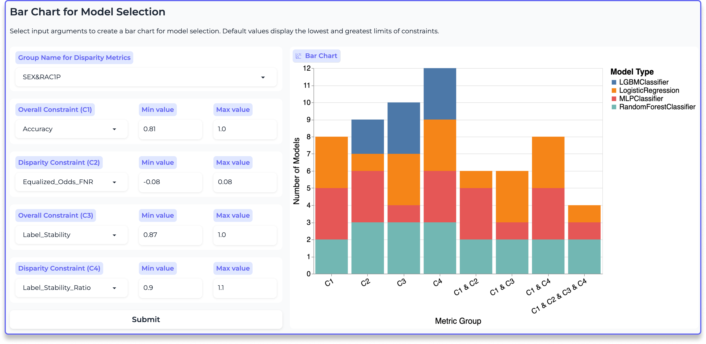
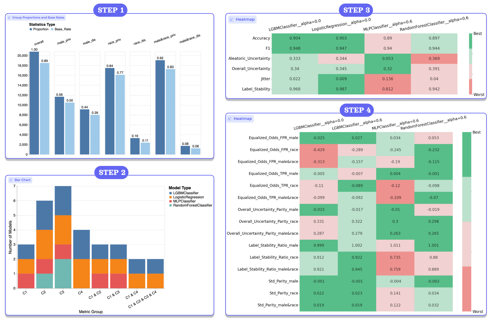
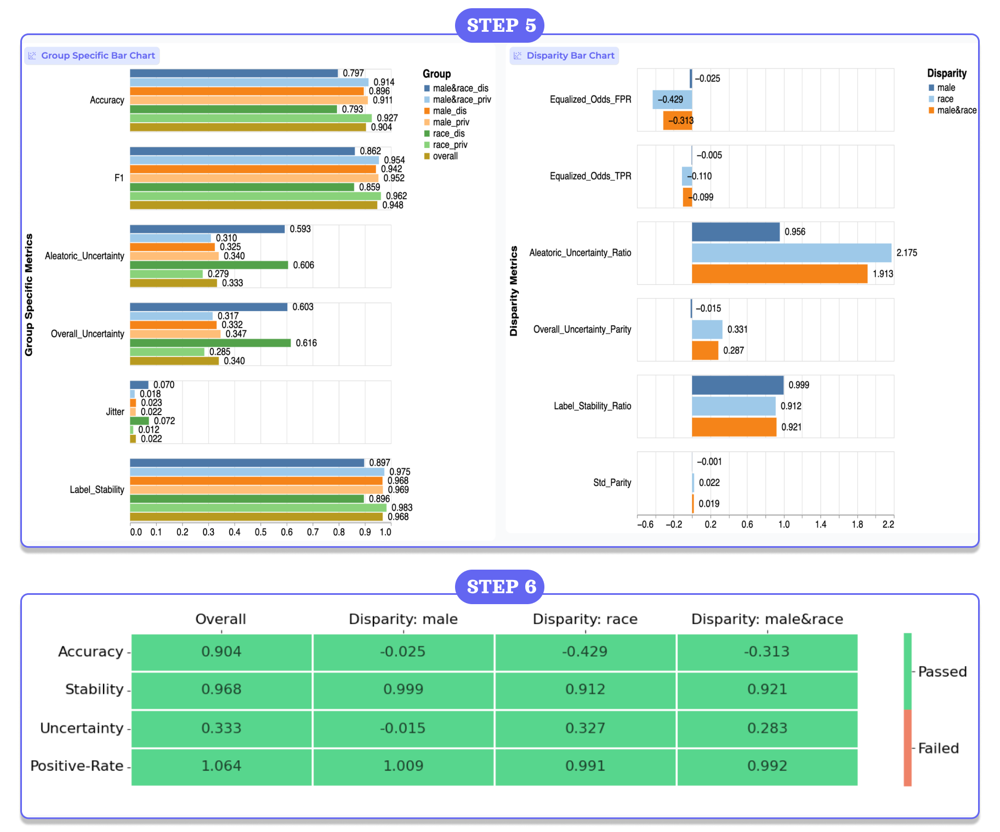

# Interactive Web App Demonstration

* [Hosted interactive app for three fair-ML benchmark datasets](https://huggingface.co/spaces/denys-herasymuk/virny-demo)
* [Demonstrative Jupyter notebooks for the Virny capabilities](https://huggingface.co/spaces/denys-herasymuk/virny-demo/tree/main/notebooks)

## Application overview

This interactive app serves as a visualization component within the Virny model profiling library, empowering data scientists
_to engage in responsible model selection_ and _to generate a nutritional label for their model_. Users can declaratively
define various configurations for model profiling, supplying a dataset and models for scrutiny to Virny. This library
computes overall and disparity metrics, profiling model accuracy, stability, uncertainty, and fairness. 
Subsequently, the tool utilizes the output from Virny to construct an interactive web application for metric analytics. 
This application allows users to scrutinize dataset properties related to protected groups, compare models 
across diverse performance dimensions, and generate a comprehensive nutritional label for the most optimal model.

*Figure 1. A sample UI view of the second screen in the interactive web app.*

The application comprises six screens, each featuring user input options and a corresponding visualization 
based on the provided inputs. To facilitate analysis, users have the flexibility to interactively choose a specific combination of models,
overall metrics, and disparity metrics across various model dimensions. This selection dynamically alters the visualization perspective.
Refer to Figure 1 for a visual representation of the sample web interface showcasing these screens.

## User flow description

Our tool is developed with a user-friendly flow design specifically tailored to guide users through a responsible model selection process.
This streamlined flow reduces the complexity associated with numerous model types and pre-, in-, and post-processing techniques.
It facilitates a comprehensive comparison of selected models based on various performance dimensions using intuitive visualizations 
such as colors and tolerance. Additionally, it allows users to break down the performance of a specific model 
concerning multiple protected groups and performance dimensions.

The user flow comprises six steps, as illustrated in Figures 2 and 3, and can be outlined as follows.

*Figure 2. Steps 1-4 in the user flow for responsible model selection.*

_**Step 1**: Analyze demographic composition of the dataset._

The application is structured from a high-level overview to a detailed examination. The upper screens provide general insights
into the dataset and models, while the lower screens delve into the performance of individual models, dissected by protected groups.
Thus, prior to delving into metric analysis, it is crucial to establish a comprehensive understanding of the proportions and 
base rates of the protected groups within the dataset. This information serves to elucidate potential disparities, for example, 
such as significant variations in overall accuracy and stability among different racial groups. Additionally, it can indicate 
whether the model has learned something by comparing its accuracy to the base rate in  the dataset.

_**Step 2**: Reduce the number of models to compare based on overall and disparity metric constraints._

Creating an accurate, robust, and fair model requires thorough validation of various model types, pre-processing techniques,
and fairness interventions. However, the complexity arises when attempting to directly compare all models on a single plot or
visualize every possible combination of the models. As a result, in the second step, we allow the user to define overall and
disparity metric constraints to effectively narrow down the selection of models that meet these criteria. This strategic reduction allows
for a more detailed comparison of diverse metrics, focusing on a more manageable number of models in the subsequent steps.

_**Steps 3-4**: Compare the selected models that satisfy all constraints using overall and disparity metric heatmaps._

In the third and fourth steps, we select a set of models that satisfy all constraints from the second step, 
and compare their overall and disparity metrics side-by-side. To enhance clarity, we added a color scheme, where green signifies
the most favorable model metric and red denotes the least favorable compared to other models.

It's crucial to acknowledge that the color scheme accommodates variations in optimal values for different metrics. 
For instance, a score of 1.0 is optimal for Disparate Impact, while 0.0 is optimal for Equalized Odds FNR. Furthermore, 
users have the option to introduce a tolerance parameter to the comparison process. This means that if the discrepancy 
between metrics of different models falls below the tolerance threshold, these models are grouped together. This proves beneficial
in cases where minor differences, such as 0.001%, can be considered negligible in comparison to the differences of other model metrics.
Steps 3 and 4 collectively provide users with a better understanding of model performance across diverse dimensions relative to other models. 
Subsequently, users can choose one or two models for a detailed breakdown of performance across protected groups 
and generate a comprehensive nutritional label in the later steps.

*Figure 3. Steps 5-6 in the user flow for responsible model selection.*

_**Step 5**: Generate a nutritional label for the selected model._

In the fifth step, users choose a particular model and a combination of overall and disparity metrics to generate a nutritional label, 
segmented by multiple protected groups and performance dimensions. The nutritional label includes bar charts for 
the overall and disparity metrics presented side-by-side that helps to find interesting insights between them. 
This graphical representation proves particularly effective in identifying performance gaps among binary or intersectional groups.

Moreover, this visualization can be added to a model card, contributing to a responsible reporting mechanism that transparently 
communicates the model's performance across diverse dimensions.

_**Step 6**: Summarize the performance of a particular model across different dimensions and protected groups._

Finally, in the sixth step, users select a particular model and specify a desirable range for overall and disparity metrics
encompassing accuracy, stability, uncertainty, and positive rate dimensions. This allows for a clear indication of whether a specific model 
meets these defined constraints. The matrix adopts a color-coded scheme, where green signifies compliance with the constraints, 
and red signals non-compliance. This final colored matrix serves as a model performance summary and can be incorporated into a model card, 
similarly to the visualization generated in the fifth step.
