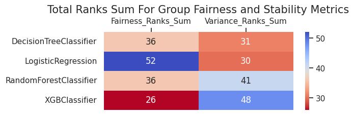

# Multiple Models Interface Usage

In this example, we are going to audit 4 models for stability and fairness, visualize metrics, and create an analysis report. For that, we will use `compute_metrics_with_config` interface that can compute metrics for multiple models. Thus, we will need to do the next steps:

* Initialize input variables

* Compute subgroup metrics

* Make group metrics composition

* Create metrics visualizations and an analysis report

## Import dependencies


```python
import os
import pandas as pd
from pprint import pprint
from datetime import datetime, timezone

from xgboost import XGBClassifier
from sklearn.tree import DecisionTreeClassifier
from sklearn.ensemble import RandomForestClassifier
from sklearn.linear_model import LogisticRegression

from sklearn.compose import ColumnTransformer
from sklearn.preprocessing import OneHotEncoder
from sklearn.preprocessing import StandardScaler

from virny.utils.custom_initializers import create_config_obj, read_model_metric_dfs, create_models_config_from_tuned_params_df
from virny.user_interfaces.metrics_computation_interfaces import compute_metrics_with_config
from virny.preprocessing.basic_preprocessing import preprocess_dataset
from virny.custom_classes.metrics_visualizer import MetricsVisualizer
from virny.custom_classes.metrics_composer import MetricsComposer
from virny.utils.model_tuning_utils import tune_ML_models
from virny.datasets.base import BaseDataLoader
from virny.configs.constants import ReportType
```

## Initialize Input Variables

Based on the library flow, we need to create 3 input objects for a user interface:

* A **config yaml** that is a file with configuration parameters for different user interfaces for metrics computation.

* A **dataset class** that is a wrapper above the user’s raw dataset that includes its descriptive attributes like a target column, numerical columns, categorical columns, etc. This class must be inherited from the BaseDataset class, which was created for user convenience.

* Finally, a **models config** that is a Python dictionary, where keys are model names and values are initialized models for analysis. This dictionary helps conduct audits for different analysis modes and analyze different types of models.


```python
DATASET_SPLIT_SEED = 42
MODELS_TUNING_SEED = 42
TEST_SET_FRACTION = 0.2
```


```python
models_params_for_tuning = {
    'DecisionTreeClassifier': {
        'model': DecisionTreeClassifier(random_state=MODELS_TUNING_SEED),
        'params': {
            "max_depth": [20, 30],
            "min_samples_split" : [0.1],
            "max_features": ['sqrt'],
            "criterion": ["gini", "entropy"]
        }
    },
    'LogisticRegression': {
        'model': LogisticRegression(random_state=MODELS_TUNING_SEED),
        'params': {
            'penalty': ['l2'],
            'C' : [0.0001, 0.1, 1, 100],
            'solver': ['newton-cg', 'lbfgs'],
            'max_iter': [250],
        }
    },
    'RandomForestClassifier': {
        'model': RandomForestClassifier(random_state=MODELS_TUNING_SEED),
        'params': {
            "max_depth": [6, 10],
            "min_samples_leaf": [1],
            "n_estimators": [50, 100],
            "max_features": [0.6]
        }
    },
    'XGBClassifier': {
        'model': XGBClassifier(random_state=MODELS_TUNING_SEED, verbosity=0),
        'params': {
            'learning_rate': [0.1],
            'n_estimators': [200],
            'max_depth': [5, 7],
            'lambda':  [10, 100]
        }
    }
}
```

### Create a config object

`compute_metrics_with_config` interface requires that your **yaml file** includes the following parameters:

* **dataset_name**: str, a name of your dataset; it will be used to name files with metrics.

* **bootstrap_fraction**: float, the fraction from a train set in the range [0.0 - 1.0] to fit models in bootstrap (usually more than 0.5).

* **n_estimators**: int, the number of estimators for bootstrap to compute subgroup stability metrics.

* **sensitive_attributes_dct**: dict, a dictionary where keys are sensitive attribute names (including attribute intersections), and values are privileged values for these attributes. Currently, the library supports only intersections among two sensitive attributes. Intersectional attributes must include '&' between sensitive attributes. You do not need to specify privileged values for intersectional groups since they will be derived from privileged values in sensitive_attributes_dct for each separate sensitive attribute in this intersectional pair.


```python
ROOT_DIR = os.path.join('docs', 'examples')
config_yaml_path = os.path.join(ROOT_DIR, 'experiment_config.yaml')
config_yaml_content = """
dataset_name: COMPAS_Without_Sensitive_Attributes
bootstrap_fraction: 0.8
n_estimators: 50  # Better to input the higher number of estimators than 100; this is only for this use case example
sensitive_attributes_dct: {'sex': 1, 'race': 'African-American', 'sex&race': None}
"""

with open(config_yaml_path, 'w', encoding='utf-8') as f:
    f.write(config_yaml_content)
```


```python
config = create_config_obj(config_yaml_path=config_yaml_path)
SAVE_RESULTS_DIR_PATH = os.path.join(ROOT_DIR, 'results', f'{config.dataset_name}_Metrics_{datetime.now(timezone.utc).strftime("%Y%m%d__%H%M%S")}')
```

### Preprocess the dataset and create a BaseFlowDataset class

Based on the BaseDataset class, your **dataset class** should include the following attributes:

* **Obligatory attributes**: dataset, target, features, numerical_columns, categorical_columns

* **Optional attributes**: X_data, y_data, columns_with_nulls

For more details, please refer to the library documentation.


```python
class CompasWithoutSensitiveAttrsDataset(BaseDataLoader):
    """
    Dataset class for COMPAS dataset that does not contain sensitive attributes among feature columns
     to test blind classifiers

    Parameters
    ----------
    subsample_size
        Subsample size to create based on the input dataset

    """
    def __init__(self, dataset_path, subsample_size: int = None):
        df = pd.read_csv(dataset_path)
        if subsample_size:
            df = df.sample(subsample_size)

        # Initial data types transformation
        int_columns = ['recidivism', 'age', 'age_cat_25 - 45', 'age_cat_Greater than 45',
                       'age_cat_Less than 25', 'c_charge_degree_F', 'c_charge_degree_M', 'sex']
        int_columns_dct = {col: "int" for col in int_columns}
        df = df.astype(int_columns_dct)

        # Define params
        target = 'recidivism'
        numerical_columns = ['juv_fel_count', 'juv_misd_count', 'juv_other_count','priors_count']
        categorical_columns = ['age_cat_25 - 45', 'age_cat_Greater than 45','age_cat_Less than 25',
                               'c_charge_degree_F', 'c_charge_degree_M']

        super().__init__(
            full_df=df,
            target=target,
            numerical_columns=numerical_columns,
            categorical_columns=categorical_columns
        )
```


```python
data_loader = CompasWithoutSensitiveAttrsDataset(dataset_path=os.path.join('virny', 'datasets', 'COMPAS.csv'))
data_loader.X_data[data_loader.X_data.columns[:5]].head()
```


<div>
<style scoped>
    .dataframe tbody tr th:only-of-type {
        vertical-align: middle;
    }

    .dataframe tbody tr th {
        vertical-align: top;
    }

    .dataframe thead th {
        text-align: right;
    }
</style>
<table border="1" class="dataframe">
  <thead>
    <tr style="text-align: right;">
      <th></th>
      <th>juv_fel_count</th>
      <th>juv_misd_count</th>
      <th>juv_other_count</th>
      <th>priors_count</th>
      <th>age_cat_25 - 45</th>
    </tr>
  </thead>
  <tbody>
    <tr>
      <th>0</th>
      <td>0.0</td>
      <td>-2.340451</td>
      <td>1.0</td>
      <td>-15.010999</td>
      <td>1</td>
    </tr>
    <tr>
      <th>1</th>
      <td>0.0</td>
      <td>0.000000</td>
      <td>0.0</td>
      <td>0.000000</td>
      <td>1</td>
    </tr>
    <tr>
      <th>2</th>
      <td>0.0</td>
      <td>0.000000</td>
      <td>0.0</td>
      <td>0.000000</td>
      <td>0</td>
    </tr>
    <tr>
      <th>3</th>
      <td>0.0</td>
      <td>0.000000</td>
      <td>0.0</td>
      <td>6.000000</td>
      <td>1</td>
    </tr>
    <tr>
      <th>4</th>
      <td>0.0</td>
      <td>0.000000</td>
      <td>0.0</td>
      <td>7.513697</td>
      <td>1</td>
    </tr>
  </tbody>
</table>
</div>


```python
column_transformer = ColumnTransformer(transformers=[
    ('categorical_features', OneHotEncoder(handle_unknown='ignore', sparse=False), data_loader.categorical_columns),
    ('numerical_features', StandardScaler(), data_loader.numerical_columns),
])
```


```python
base_flow_dataset = preprocess_dataset(data_loader, column_transformer, TEST_SET_FRACTION, DATASET_SPLIT_SEED)
```

### Tune models and create a models config for metrics computation


```python
tuned_params_df, models_config = tune_ML_models(models_params_for_tuning, base_flow_dataset, config.dataset_name, n_folds=3)
tuned_params_df
```

    2023/08/13, 01:39:20: Tuning DecisionTreeClassifier...
    Fitting 3 folds for each of 4 candidates, totalling 12 fits
    2023/08/13, 01:39:22: Tuning for DecisionTreeClassifier is finished [F1 score = 0.6429262328840039, Accuracy = 0.6442550505050505]
    
    2023/08/13, 01:39:22: Tuning LogisticRegression...
    Fitting 3 folds for each of 8 candidates, totalling 24 fits
    2023/08/13, 01:39:22: Tuning for LogisticRegression is finished [F1 score = 0.6461022173486363, Accuracy = 0.6505681818181818]
    
    2023/08/13, 01:39:22: Tuning RandomForestClassifier...
    Fitting 3 folds for each of 4 candidates, totalling 12 fits
    2023/08/13, 01:39:23: Tuning for RandomForestClassifier is finished [F1 score = 0.6480756802972086, Accuracy = 0.6518308080808081]
    
    2023/08/13, 01:39:23: Tuning XGBClassifier...
    Fitting 3 folds for each of 4 candidates, totalling 12 fits
    2023/08/13, 01:39:27: Tuning for XGBClassifier is finished [F1 score = 0.6548814644409034, Accuracy = 0.6587752525252525]
    


<div>
<style scoped>
    .dataframe tbody tr th:only-of-type {
        vertical-align: middle;
    }

    .dataframe tbody tr th {
        vertical-align: top;
    }

    .dataframe thead th {
        text-align: right;
    }
</style>
<table border="1" class="dataframe">
  <thead>
    <tr style="text-align: right;">
      <th></th>
      <th>Dataset_Name</th>
      <th>Model_Name</th>
      <th>F1_Score</th>
      <th>Accuracy_Score</th>
      <th>Model_Best_Params</th>
    </tr>
  </thead>
  <tbody>
    <tr>
      <th>0</th>
      <td>COMPAS_Without_Sensitive_Attributes</td>
      <td>DecisionTreeClassifier</td>
      <td>0.642926</td>
      <td>0.644255</td>
      <td>{'criterion': 'gini', 'max_depth': 20, 'max_fe...</td>
    </tr>
    <tr>
      <th>1</th>
      <td>COMPAS_Without_Sensitive_Attributes</td>
      <td>LogisticRegression</td>
      <td>0.646102</td>
      <td>0.650568</td>
      <td>{'C': 1, 'max_iter': 250, 'penalty': 'l2', 'so...</td>
    </tr>
    <tr>
      <th>2</th>
      <td>COMPAS_Without_Sensitive_Attributes</td>
      <td>RandomForestClassifier</td>
      <td>0.648076</td>
      <td>0.651831</td>
      <td>{'max_depth': 10, 'max_features': 0.6, 'min_sa...</td>
    </tr>
    <tr>
      <th>3</th>
      <td>COMPAS_Without_Sensitive_Attributes</td>
      <td>XGBClassifier</td>
      <td>0.654881</td>
      <td>0.658775</td>
      <td>{'lambda': 100, 'learning_rate': 0.1, 'max_dep...</td>
    </tr>
  </tbody>
</table>
</div>


```python
now = datetime.now(timezone.utc)
date_time_str = now.strftime("%Y%m%d__%H%M%S")
tuned_df_path = os.path.join(ROOT_DIR, 'results', 'models_tuning', f'tuning_results_{config.dataset_name}_{date_time_str}.csv')
tuned_params_df.to_csv(tuned_df_path, sep=",", columns=tuned_params_df.columns, float_format="%.4f", index=False)
```

Create models_config from the saved tuned_params_df for higher reliability


```python
models_config = create_models_config_from_tuned_params_df(models_params_for_tuning, tuned_df_path)
pprint(models_config)
```

    {'DecisionTreeClassifier': DecisionTreeClassifier(max_depth=20, max_features='sqrt', min_samples_split=0.1,
                           random_state=42),
     'LogisticRegression': LogisticRegression(C=1, max_iter=250, random_state=42, solver='newton-cg'),
     'RandomForestClassifier': RandomForestClassifier(max_depth=10, max_features=0.6, random_state=42),
     'XGBClassifier': XGBClassifier(base_score=None, booster=None, callbacks=None,
                  colsample_bylevel=None, colsample_bynode=None,
                  colsample_bytree=None, early_stopping_rounds=None,
                  enable_categorical=False, eval_metric=None, feature_types=None,
                  gamma=None, gpu_id=None, grow_policy=None, importance_type=None,
                  interaction_constraints=None, lambda=100, learning_rate=0.1,
                  max_bin=None, max_cat_threshold=None, max_cat_to_onehot=None,
                  max_delta_step=None, max_depth=5, max_leaves=None,
                  min_child_weight=None, missing=nan, monotone_constraints=None,
                  n_estimators=200, n_jobs=None, num_parallel_tree=None,
                  predictor=None, ...)}


## Subgroup Metrics Computation

After the variables are input to a user interface, the interface uses subgroup analyzers to compute different sets of metrics for each privileged and disadvantaged subgroup. As for now, our library supports **Subgroup Variance Analyzer** and **Subgroup Error Analyzer**, but it is easily extensible to any other analyzers. When the variance and error analyzers complete metrics computation, their metrics are combined, returned in a matrix format, and stored in a file if defined.


```python
metrics_dct = compute_metrics_with_config(base_flow_dataset, config, models_config, SAVE_RESULTS_DIR_PATH, verbose=1)
```

A lot of logs...


Look at several columns in top rows of computed metrics


```python
sample_model_metrics_df = metrics_dct[list(models_config.keys())[0]]
sample_model_metrics_df[sample_model_metrics_df.columns[:6]].head(20)
```


<div>
<style scoped>
    .dataframe tbody tr th:only-of-type {
        vertical-align: middle;
    }

    .dataframe tbody tr th {
        vertical-align: top;
    }

    .dataframe thead th {
        text-align: right;
    }
</style>
<table border="1" class="dataframe">
  <thead>
    <tr style="text-align: right;">
      <th></th>
      <th>Metric</th>
      <th>overall</th>
      <th>sex_priv</th>
      <th>sex_dis</th>
      <th>race_priv</th>
      <th>race_dis</th>
    </tr>
  </thead>
  <tbody>
    <tr>
      <th>0</th>
      <td>Mean</td>
      <td>0.521754</td>
      <td>0.577841</td>
      <td>0.507749</td>
      <td>0.588128</td>
      <td>0.478952</td>
    </tr>
    <tr>
      <th>1</th>
      <td>Std</td>
      <td>0.070126</td>
      <td>0.070049</td>
      <td>0.070145</td>
      <td>0.070509</td>
      <td>0.069879</td>
    </tr>
    <tr>
      <th>2</th>
      <td>IQR</td>
      <td>0.088289</td>
      <td>0.085124</td>
      <td>0.089079</td>
      <td>0.091726</td>
      <td>0.086072</td>
    </tr>
    <tr>
      <th>3</th>
      <td>Aleatoric_Uncertainty</td>
      <td>0.867014</td>
      <td>0.871857</td>
      <td>0.865805</td>
      <td>0.859131</td>
      <td>0.872098</td>
    </tr>
    <tr>
      <th>4</th>
      <td>Overall_Uncertainty</td>
      <td>0.892403</td>
      <td>0.898704</td>
      <td>0.890829</td>
      <td>0.886515</td>
      <td>0.896200</td>
    </tr>
    <tr>
      <th>5</th>
      <td>Statistical_Bias</td>
      <td>0.419045</td>
      <td>0.414878</td>
      <td>0.420086</td>
      <td>0.414936</td>
      <td>0.421695</td>
    </tr>
    <tr>
      <th>6</th>
      <td>Jitter</td>
      <td>0.122460</td>
      <td>0.126825</td>
      <td>0.121370</td>
      <td>0.122124</td>
      <td>0.122677</td>
    </tr>
    <tr>
      <th>7</th>
      <td>Per_Sample_Accuracy</td>
      <td>0.679205</td>
      <td>0.690711</td>
      <td>0.676331</td>
      <td>0.684203</td>
      <td>0.675981</td>
    </tr>
    <tr>
      <th>8</th>
      <td>Label_Stability</td>
      <td>0.833258</td>
      <td>0.823886</td>
      <td>0.835598</td>
      <td>0.827536</td>
      <td>0.836947</td>
    </tr>
    <tr>
      <th>9</th>
      <td>TPR</td>
      <td>0.656051</td>
      <td>0.493333</td>
      <td>0.686869</td>
      <td>0.523810</td>
      <td>0.716049</td>
    </tr>
    <tr>
      <th>10</th>
      <td>TNR</td>
      <td>0.726496</td>
      <td>0.801471</td>
      <td>0.703786</td>
      <td>0.779026</td>
      <td>0.682390</td>
    </tr>
    <tr>
      <th>11</th>
      <td>PPV</td>
      <td>0.658849</td>
      <td>0.578125</td>
      <td>0.671605</td>
      <td>0.566176</td>
      <td>0.696697</td>
    </tr>
    <tr>
      <th>12</th>
      <td>FNR</td>
      <td>0.343949</td>
      <td>0.506667</td>
      <td>0.313131</td>
      <td>0.476190</td>
      <td>0.283951</td>
    </tr>
    <tr>
      <th>13</th>
      <td>FPR</td>
      <td>0.273504</td>
      <td>0.198529</td>
      <td>0.296214</td>
      <td>0.220974</td>
      <td>0.317610</td>
    </tr>
    <tr>
      <th>14</th>
      <td>Accuracy</td>
      <td>0.695076</td>
      <td>0.691943</td>
      <td>0.695858</td>
      <td>0.688406</td>
      <td>0.699377</td>
    </tr>
    <tr>
      <th>15</th>
      <td>F1</td>
      <td>0.657447</td>
      <td>0.532374</td>
      <td>0.679151</td>
      <td>0.544170</td>
      <td>0.706240</td>
    </tr>
    <tr>
      <th>16</th>
      <td>Selection-Rate</td>
      <td>0.444129</td>
      <td>0.303318</td>
      <td>0.479290</td>
      <td>0.328502</td>
      <td>0.518692</td>
    </tr>
    <tr>
      <th>17</th>
      <td>Positive-Rate</td>
      <td>0.995754</td>
      <td>0.853333</td>
      <td>1.022727</td>
      <td>0.925170</td>
      <td>1.027778</td>
    </tr>
    <tr>
      <th>18</th>
      <td>Sample_Size</td>
      <td>1056.000000</td>
      <td>NaN</td>
      <td>NaN</td>
      <td>NaN</td>
      <td>NaN</td>
    </tr>
  </tbody>
</table>
</div>


## Group Metrics Composition

**Metrics Composer** is responsible for this second stage of the model audit. Currently, it computes our custom group fairness and stability metrics, but extending it for new group metrics is very simple. We noticed that more and more group metrics have appeared during the last decade, but most of them are based on the same subgroup metrics. Hence, such a separation of subgroup and group metrics computation allows one to experiment with different combinations of subgroup metrics and avoid subgroup metrics recomputation for a new set of grouped metrics.


```python
models_metrics_dct = read_model_metric_dfs(SAVE_RESULTS_DIR_PATH, model_names=list(models_config.keys()))
```


```python
metrics_composer = MetricsComposer(models_metrics_dct, config.sensitive_attributes_dct)
```

Compute composed metrics


```python
models_composed_metrics_df = metrics_composer.compose_metrics()
```

## Metrics Visualization and Reporting

**Metrics Visualizer** provides metrics visualization and reporting functionality. It unifies different preprocessing methods for result metrics and creates various data formats required for visualizations. Hence, users can simply call methods of the Metrics Visualizer class and get custom plots for diverse metrics analysis. Additionally, these plots could be collected in an HTML report with comments for user convenience and future reference.


```python
visualizer = MetricsVisualizer(models_metrics_dct, models_composed_metrics_df, config.dataset_name,
                               model_names=list(models_config.keys()),
                               sensitive_attributes_dct=config.sensitive_attributes_dct)
```


```python
visualizer.create_overall_metrics_bar_char(
    metrics_names=['TPR', 'PPV', 'Accuracy', 'F1', 'Selection-Rate', 'Positive-Rate'],
    metrics_title="Error Metrics"
)
```


<div id="altair-viz-fc3b9198f6bf462c9bec101589e2fad0"></div>
<script type="text/javascript">
  var VEGA_DEBUG = (typeof VEGA_DEBUG == "undefined") ? {} : VEGA_DEBUG;
  (function(spec, embedOpt){
    let outputDiv = document.currentScript.previousElementSibling;
    if (outputDiv.id !== "altair-viz-fc3b9198f6bf462c9bec101589e2fad0") {
      outputDiv = document.getElementById("altair-viz-fc3b9198f6bf462c9bec101589e2fad0");
    }
    const paths = {
      "vega": "https://cdn.jsdelivr.net/npm//vega@5?noext",
      "vega-lib": "https://cdn.jsdelivr.net/npm//vega-lib?noext",
      "vega-lite": "https://cdn.jsdelivr.net/npm//vega-lite@4.17.0?noext",
      "vega-embed": "https://cdn.jsdelivr.net/npm//vega-embed@6?noext",
    };

    function maybeLoadScript(lib, version) {
      var key = `${lib.replace("-", "")}_version`;
      return (VEGA_DEBUG[key] == version) ?
        Promise.resolve(paths[lib]) :
        new Promise(function(resolve, reject) {
          var s = document.createElement('script');
          document.getElementsByTagName("head")[0].appendChild(s);
          s.async = true;
          s.onload = () => {
            VEGA_DEBUG[key] = version;
            return resolve(paths[lib]);
          };
          s.onerror = () => reject(`Error loading script: ${paths[lib]}`);
          s.src = paths[lib];
        });
    }

    function showError(err) {
      outputDiv.innerHTML = `<div class="error" style="color:red;">${err}</div>`;
      throw err;
    }

    function displayChart(vegaEmbed) {
      vegaEmbed(outputDiv, spec, embedOpt)
        .catch(err => showError(`Javascript Error: ${err.message}<br>This usually means there's a typo in your chart specification. See the javascript console for the full traceback.`));
    }

    if(typeof define === "function" && define.amd) {
      requirejs.config({paths});
      require(["vega-embed"], displayChart, err => showError(`Error loading script: ${err.message}`));
    } else {
      maybeLoadScript("vega", "5")
        .then(() => maybeLoadScript("vega-lite", "4.17.0"))
        .then(() => maybeLoadScript("vega-embed", "6"))
        .catch(showError)
        .then(() => displayChart(vegaEmbed));
    }
  })({"config": {"view": {"continuousWidth": 400, "continuousHeight": 300}, "axis": {"labelFontSize": 14, "titleFontSize": 18}, "headerRow": {"labelAlign": "left", "labelAngle": 0, "labelFontSize": 14, "labelPadding": 10, "titleFontSize": 18}}, "data": {"name": "data-720a9f51e9f02fe1a9b2ddf6d5b1f914"}, "mark": "bar", "encoding": {"color": {"field": "model_name", "legend": {"labelFontSize": 13, "title": "Model Name", "titleFontSize": 13}, "scale": {"scheme": "tableau20"}, "type": "nominal"}, "row": {"field": "metric", "title": "Error Metrics", "type": "nominal"}, "x": {"axis": {"grid": true}, "field": "overall", "title": "", "type": "quantitative"}, "y": {"axis": null, "field": "model_name", "type": "nominal"}}, "height": 50, "width": 500, "$schema": "https://vega.github.io/schema/vega-lite/v4.17.0.json", "datasets": {"data-720a9f51e9f02fe1a9b2ddf6d5b1f914": [{"overall": 0.6950757575757576, "metric": "Accuracy", "model_name": "DecisionTreeClassifier"}, {"overall": 0.6574468085106383, "metric": "F1", "model_name": "DecisionTreeClassifier"}, {"overall": 0.6588486140724946, "metric": "PPV", "model_name": "DecisionTreeClassifier"}, {"overall": 0.9957537154989384, "metric": "Positive-Rate", "model_name": "DecisionTreeClassifier"}, {"overall": 0.4441287878787879, "metric": "Selection-Rate", "model_name": "DecisionTreeClassifier"}, {"overall": 0.6560509554140127, "metric": "TPR", "model_name": "DecisionTreeClassifier"}, {"overall": 0.6846590909090909, "metric": "Accuracy", "model_name": "LogisticRegression"}, {"overall": 0.6392199349945829, "metric": "F1", "model_name": "LogisticRegression"}, {"overall": 0.6526548672566371, "metric": "PPV", "model_name": "LogisticRegression"}, {"overall": 0.9596602972399152, "metric": "Positive-Rate", "model_name": "LogisticRegression"}, {"overall": 0.428030303030303, "metric": "Selection-Rate", "model_name": "LogisticRegression"}, {"overall": 0.6263269639065817, "metric": "TPR", "model_name": "LogisticRegression"}, {"overall": 0.7064393939393939, "metric": "Accuracy", "model_name": "RandomForestClassifier"}, {"overall": 0.6709129511677282, "metric": "F1", "model_name": "RandomForestClassifier"}, {"overall": 0.6709129511677282, "metric": "PPV", "model_name": "RandomForestClassifier"}, {"overall": 1.0, "metric": "Positive-Rate", "model_name": "RandomForestClassifier"}, {"overall": 0.4460227272727273, "metric": "Selection-Rate", "model_name": "RandomForestClassifier"}, {"overall": 0.6709129511677282, "metric": "TPR", "model_name": "RandomForestClassifier"}, {"overall": 0.7007575757575758, "metric": "Accuracy", "model_name": "XGBClassifier"}, {"overall": 0.6631130063965884, "metric": "F1", "model_name": "XGBClassifier"}, {"overall": 0.6659528907922913, "metric": "PPV", "model_name": "XGBClassifier"}, {"overall": 0.9915074309978767, "metric": "Positive-Rate", "model_name": "XGBClassifier"}, {"overall": 0.4422348484848485, "metric": "Selection-Rate", "model_name": "XGBClassifier"}, {"overall": 0.6602972399150743, "metric": "TPR", "model_name": "XGBClassifier"}]}}, {"mode": "vega-lite"});
</script>


```python
visualizer.create_overall_metrics_bar_char(
    metrics_names=['Label_Stability'],
    reversed_metrics_names=['Std', 'IQR', 'Jitter'],
    metrics_title="Variance Metrics"
)
```


<div id="altair-viz-77edff2a995043e69e3041ef9517fadd"></div>
<script type="text/javascript">
  var VEGA_DEBUG = (typeof VEGA_DEBUG == "undefined") ? {} : VEGA_DEBUG;
  (function(spec, embedOpt){
    let outputDiv = document.currentScript.previousElementSibling;
    if (outputDiv.id !== "altair-viz-77edff2a995043e69e3041ef9517fadd") {
      outputDiv = document.getElementById("altair-viz-77edff2a995043e69e3041ef9517fadd");
    }
    const paths = {
      "vega": "https://cdn.jsdelivr.net/npm//vega@5?noext",
      "vega-lib": "https://cdn.jsdelivr.net/npm//vega-lib?noext",
      "vega-lite": "https://cdn.jsdelivr.net/npm//vega-lite@4.17.0?noext",
      "vega-embed": "https://cdn.jsdelivr.net/npm//vega-embed@6?noext",
    };

    function maybeLoadScript(lib, version) {
      var key = `${lib.replace("-", "")}_version`;
      return (VEGA_DEBUG[key] == version) ?
        Promise.resolve(paths[lib]) :
        new Promise(function(resolve, reject) {
          var s = document.createElement('script');
          document.getElementsByTagName("head")[0].appendChild(s);
          s.async = true;
          s.onload = () => {
            VEGA_DEBUG[key] = version;
            return resolve(paths[lib]);
          };
          s.onerror = () => reject(`Error loading script: ${paths[lib]}`);
          s.src = paths[lib];
        });
    }

    function showError(err) {
      outputDiv.innerHTML = `<div class="error" style="color:red;">${err}</div>`;
      throw err;
    }

    function displayChart(vegaEmbed) {
      vegaEmbed(outputDiv, spec, embedOpt)
        .catch(err => showError(`Javascript Error: ${err.message}<br>This usually means there's a typo in your chart specification. See the javascript console for the full traceback.`));
    }

    if(typeof define === "function" && define.amd) {
      requirejs.config({paths});
      require(["vega-embed"], displayChart, err => showError(`Error loading script: ${err.message}`));
    } else {
      maybeLoadScript("vega", "5")
        .then(() => maybeLoadScript("vega-lite", "4.17.0"))
        .then(() => maybeLoadScript("vega-embed", "6"))
        .catch(showError)
        .then(() => displayChart(vegaEmbed));
    }
  })({"config": {"view": {"continuousWidth": 400, "continuousHeight": 300}, "axis": {"labelFontSize": 14, "titleFontSize": 18}, "headerRow": {"labelAlign": "left", "labelAngle": 0, "labelFontSize": 14, "labelPadding": 10, "titleFontSize": 18}}, "data": {"name": "data-2ea6c7d2f3b5b1f22937e2345c06fe1f"}, "mark": "bar", "encoding": {"color": {"field": "model_name", "legend": {"labelFontSize": 13, "title": "Model Name", "titleFontSize": 13}, "scale": {"scheme": "tableau20"}, "type": "nominal"}, "row": {"field": "metric", "title": "Variance Metrics", "type": "nominal"}, "x": {"axis": {"grid": true}, "field": "overall", "title": "", "type": "quantitative"}, "y": {"axis": null, "field": "model_name", "type": "nominal"}}, "height": 50, "width": 500, "$schema": "https://vega.github.io/schema/vega-lite/v4.17.0.json", "datasets": {"data-2ea6c7d2f3b5b1f22937e2345c06fe1f": [{"overall": 0.9117111790185323, "metric": "IQR", "model_name": "DecisionTreeClassifier"}, {"overall": 0.877540197897341, "metric": "Jitter", "model_name": "DecisionTreeClassifier"}, {"overall": 0.8332575757575759, "metric": "Label_Stability", "model_name": "DecisionTreeClassifier"}, {"overall": 0.9298738011166754, "metric": "Std", "model_name": "DecisionTreeClassifier"}, {"overall": 0.9717800402680609, "metric": "IQR", "model_name": "LogisticRegression"}, {"overall": 0.9575602968460111, "metric": "Jitter", "model_name": "LogisticRegression"}, {"overall": 0.9434848484848484, "metric": "Label_Stability", "model_name": "LogisticRegression"}, {"overall": 0.9785530149487845, "metric": "Std", "model_name": "LogisticRegression"}, {"overall": 0.908111657225227, "metric": "IQR", "model_name": "RandomForestClassifier"}, {"overall": 0.8833812615955474, "metric": "Jitter", "model_name": "RandomForestClassifier"}, {"overall": 0.8343939393939394, "metric": "Label_Stability", "model_name": "RandomForestClassifier"}, {"overall": 0.9304183190307501, "metric": "Std", "model_name": "RandomForestClassifier"}, {"overall": 0.9401662337565513, "metric": "IQR", "model_name": "XGBClassifier"}, {"overall": 0.9276576994434139, "metric": "Jitter", "model_name": "XGBClassifier"}, {"overall": 0.905681818181818, "metric": "Label_Stability", "model_name": "XGBClassifier"}, {"overall": 0.9545392841100693, "metric": "Std", "model_name": "XGBClassifier"}]}}, {"mode": "vega-lite"});
</script>


Below is an example of an interactive plot. It requires that you run the below cell in Jupyter in the browser or EDAs, which support JavaScript displaying.

You can use this plot to compare any pair of group fairness and stability metrics for all models.


```python
visualizer.create_fairness_variance_interactive_bar_chart()
```


<div id="altair-viz-80b15c2ee6ed49f88e3c67cf2e05d7e8"></div>
<script type="text/javascript">
  var VEGA_DEBUG = (typeof VEGA_DEBUG == "undefined") ? {} : VEGA_DEBUG;
  (function(spec, embedOpt){
    let outputDiv = document.currentScript.previousElementSibling;
    if (outputDiv.id !== "altair-viz-80b15c2ee6ed49f88e3c67cf2e05d7e8") {
      outputDiv = document.getElementById("altair-viz-80b15c2ee6ed49f88e3c67cf2e05d7e8");
    }
    const paths = {
      "vega": "https://cdn.jsdelivr.net/npm//vega@5?noext",
      "vega-lib": "https://cdn.jsdelivr.net/npm//vega-lib?noext",
      "vega-lite": "https://cdn.jsdelivr.net/npm//vega-lite@4.17.0?noext",
      "vega-embed": "https://cdn.jsdelivr.net/npm//vega-embed@6?noext",
    };

    function maybeLoadScript(lib, version) {
      var key = `${lib.replace("-", "")}_version`;
      return (VEGA_DEBUG[key] == version) ?
        Promise.resolve(paths[lib]) :
        new Promise(function(resolve, reject) {
          var s = document.createElement('script');
          document.getElementsByTagName("head")[0].appendChild(s);
          s.async = true;
          s.onload = () => {
            VEGA_DEBUG[key] = version;
            return resolve(paths[lib]);
          };
          s.onerror = () => reject(`Error loading script: ${paths[lib]}`);
          s.src = paths[lib];
        });
    }

    function showError(err) {
      outputDiv.innerHTML = `<div class="error" style="color:red;">${err}</div>`;
      throw err;
    }

    function displayChart(vegaEmbed) {
      vegaEmbed(outputDiv, spec, embedOpt)
        .catch(err => showError(`Javascript Error: ${err.message}<br>This usually means there's a typo in your chart specification. See the javascript console for the full traceback.`));
    }

    if(typeof define === "function" && define.amd) {
      requirejs.config({paths});
      require(["vega-embed"], displayChart, err => showError(`Error loading script: ${err.message}`));
    } else {
      maybeLoadScript("vega", "5")
        .then(() => maybeLoadScript("vega-lite", "4.17.0"))
        .then(() => maybeLoadScript("vega-embed", "6"))
        .catch(showError)
        .then(() => displayChart(vegaEmbed));
    }
  })({"config": {"view": {"continuousWidth": 400, "continuousHeight": 300}}, "hconcat": [{"vconcat": [{"data": {"name": "data-d94f4bf3dc358f3a13ab8877ff38df6d"}, "mark": {"type": "circle", "size": 200}, "encoding": {"color": {"condition": {"field": "Metric", "legend": null, "scale": {"scheme": "tableau20"}, "type": "nominal", "selection": "selector009"}, "value": "lightgray"}, "y": {"axis": {"title": "Select Fairness Metric", "titleFontSize": 15}, "field": "Metric", "type": "nominal"}}, "height": 200, "selection": {"selector009": {"type": "single", "fields": ["Metric"], "init": {"Metric": "Accuracy_Parity"}, "empty": "none"}}, "width": 50}, {"data": {"name": "data-53533b8f0949bcf4751a0922d0015f90"}, "mark": {"type": "circle", "size": 200}, "encoding": {"color": {"condition": {"field": "Metric", "legend": null, "scale": {"scheme": "tableau20"}, "type": "nominal", "selection": "selector010"}, "value": "lightgray"}, "y": {"axis": {"title": "Select Variance Metric", "titleFontSize": 15}, "field": "Metric", "type": "nominal"}}, "height": 200, "selection": {"selector010": {"type": "single", "fields": ["Metric"], "init": {"Metric": "IQR_Parity"}, "empty": "none"}}, "width": 50}, {"data": {"name": "data-d94f4bf3dc358f3a13ab8877ff38df6d"}, "mark": {"type": "circle", "size": 200}, "encoding": {"color": {"field": "Model_Name", "scale": {"scheme": "tableau20"}, "type": "nominal"}, "y": {"axis": {"title": "Model Name", "titleFontSize": 15}, "field": "Model_Name", "type": "nominal"}}, "height": 200, "width": 50}]}, {"data": {"name": "data-d94f4bf3dc358f3a13ab8877ff38df6d"}, "mark": "bar", "encoding": {"color": {"field": "Model_Name", "scale": {"scheme": "tableau20"}, "type": "nominal"}, "row": {"field": "Subgroup", "title": "Group", "type": "nominal"}, "x": {"field": "Value", "type": "quantitative"}, "y": {"axis": null, "field": "Model_Name", "type": "nominal"}}, "height": 200, "title": "Fairness Metric Plot", "transform": [{"filter": {"selection": "selector009"}}], "width": 300}, {"data": {"name": "data-53533b8f0949bcf4751a0922d0015f90"}, "mark": "bar", "encoding": {"color": {"field": "Model_Name", "scale": {"scheme": "tableau20"}, "type": "nominal"}, "row": {"field": "Subgroup", "title": "Group", "type": "nominal"}, "x": {"field": "Value", "type": "quantitative"}, "y": {"axis": null, "field": "Model_Name", "type": "nominal"}}, "height": 200, "title": "Variance Metric Plot", "transform": [{"filter": {"selection": "selector010"}}], "width": 300}], "$schema": "https://vega.github.io/schema/vega-lite/v4.17.0.json", "datasets": {"data-d94f4bf3dc358f3a13ab8877ff38df6d": [{"Metric": "Equalized_Odds_TPR", "Model_Name": "DecisionTreeClassifier", "Subgroup": "sex", "Value": 0.19353535353535356}, {"Metric": "Equalized_Odds_FPR", "Model_Name": "DecisionTreeClassifier", "Subgroup": "sex", "Value": 0.0976843966985459}, {"Metric": "Disparate_Impact", "Model_Name": "DecisionTreeClassifier", "Subgroup": "sex", "Value": 1.1985085227272727}, {"Metric": "Statistical_Parity_Difference", "Model_Name": "DecisionTreeClassifier", "Subgroup": "sex", "Value": 0.16939393939393932}, {"Metric": "Accuracy_Parity", "Model_Name": "DecisionTreeClassifier", "Subgroup": "sex", "Value": 0.003914860203595105}, {"Metric": "Equalized_Odds_TPR", "Model_Name": "LogisticRegression", "Subgroup": "sex", "Value": 0.1898989898989899}, {"Metric": "Equalized_Odds_FPR", "Model_Name": "LogisticRegression", "Subgroup": "sex", "Value": 0.1005829948906066}, {"Metric": "Disparate_Impact", "Model_Name": "LogisticRegression", "Subgroup": "sex", "Value": 1.2139841033283654}, {"Metric": "Statistical_Parity_Difference", "Model_Name": "LogisticRegression", "Subgroup": "sex", "Value": 0.17404040404040388}, {"Metric": "Accuracy_Parity", "Model_Name": "LogisticRegression", "Subgroup": "sex", "Value": -0.003180122830141019}, {"Metric": "Equalized_Odds_TPR", "Model_Name": "RandomForestClassifier", "Subgroup": "sex", "Value": 0.11606060606060609}, {"Metric": "Equalized_Odds_FPR", "Model_Name": "RandomForestClassifier", "Subgroup": "sex", "Value": 0.0769684265688459}, {"Metric": "Disparate_Impact", "Model_Name": "RandomForestClassifier", "Subgroup": "sex", "Value": 1.0670081092616304}, {"Metric": "Statistical_Parity_Difference", "Model_Name": "RandomForestClassifier", "Subgroup": "sex", "Value": 0.0634343434343434}, {"Metric": "Accuracy_Parity", "Model_Name": "RandomForestClassifier", "Subgroup": "sex", "Value": -0.011497798592220665}, {"Metric": "Equalized_Odds_TPR", "Model_Name": "XGBClassifier", "Subgroup": "sex", "Value": 0.16686868686868683}, {"Metric": "Equalized_Odds_FPR", "Model_Name": "XGBClassifier", "Subgroup": "sex", "Value": 0.0696154853923753}, {"Metric": "Disparate_Impact", "Model_Name": "XGBClassifier", "Subgroup": "sex", "Value": 1.1112967914438503}, {"Metric": "Statistical_Parity_Difference", "Model_Name": "XGBClassifier", "Subgroup": "sex", "Value": 0.10090909090909095}, {"Metric": "Accuracy_Parity", "Model_Name": "XGBClassifier", "Subgroup": "sex", "Value": 0.011015451919571428}, {"Metric": "Equalized_Odds_TPR", "Model_Name": "DecisionTreeClassifier", "Subgroup": "race", "Value": 0.1922398589065255}, {"Metric": "Equalized_Odds_FPR", "Model_Name": "DecisionTreeClassifier", "Subgroup": "race", "Value": 0.0966362801215461}, {"Metric": "Disparate_Impact", "Model_Name": "DecisionTreeClassifier", "Subgroup": "race", "Value": 1.110906862745098}, {"Metric": "Statistical_Parity_Difference", "Model_Name": "DecisionTreeClassifier", "Subgroup": "race", "Value": 0.10260770975056688}, {"Metric": "Accuracy_Parity", "Model_Name": "DecisionTreeClassifier", "Subgroup": "race", "Value": 0.01097114993904924}, {"Metric": "Equalized_Odds_TPR", "Model_Name": "LogisticRegression", "Subgroup": "race", "Value": 0.25781053162005546}, {"Metric": "Equalized_Odds_FPR", "Model_Name": "LogisticRegression", "Subgroup": "race", "Value": 0.15610204225849758}, {"Metric": "Disparate_Impact", "Model_Name": "LogisticRegression", "Subgroup": "race", "Value": 1.329549114331723}, {"Metric": "Statistical_Parity_Difference", "Model_Name": "LogisticRegression", "Subgroup": "race", "Value": 0.2578105316200554}, {"Metric": "Accuracy_Parity", "Model_Name": "LogisticRegression", "Subgroup": "race", "Value": -0.0021897151112917346}, {"Metric": "Equalized_Odds_TPR", "Model_Name": "RandomForestClassifier", "Subgroup": "race", "Value": 0.14462081128747795}, {"Metric": "Equalized_Odds_FPR", "Model_Name": "RandomForestClassifier", "Subgroup": "race", "Value": 0.1360327892021766}, {"Metric": "Disparate_Impact", "Model_Name": "RandomForestClassifier", "Subgroup": "race", "Value": 1.1292181069958847}, {"Metric": "Statistical_Parity_Difference", "Model_Name": "RandomForestClassifier", "Subgroup": "race", "Value": 0.11866969009826134}, {"Metric": "Accuracy_Parity", "Model_Name": "RandomForestClassifier", "Subgroup": "race", "Value": -0.029933631315183562}, {"Metric": "Equalized_Odds_TPR", "Model_Name": "XGBClassifier", "Subgroup": "race", "Value": 0.15885613504661134}, {"Metric": "Equalized_Odds_FPR", "Model_Name": "XGBClassifier", "Subgroup": "race", "Value": 0.09783760864956542}, {"Metric": "Disparate_Impact", "Model_Name": "XGBClassifier", "Subgroup": "race", "Value": 1.0816559312936127}, {"Metric": "Statistical_Parity_Difference", "Model_Name": "XGBClassifier", "Subgroup": "race", "Value": 0.0766565885613506}, {"Metric": "Accuracy_Parity", "Model_Name": "XGBClassifier", "Subgroup": "race", "Value": -0.0035216036841392295}, {"Metric": "Equalized_Odds_TPR", "Model_Name": "DecisionTreeClassifier", "Subgroup": "sex&race", "Value": 0.1800428539207578}, {"Metric": "Equalized_Odds_FPR", "Model_Name": "DecisionTreeClassifier", "Subgroup": "sex&race", "Value": 0.12924322640921837}, {"Metric": "Disparate_Impact", "Model_Name": "DecisionTreeClassifier", "Subgroup": "sex&race", "Value": 1.0959254157433471}, {"Metric": "Statistical_Parity_Difference", "Model_Name": "DecisionTreeClassifier", "Subgroup": "sex&race", "Value": 0.09031275843921516}, {"Metric": "Accuracy_Parity", "Model_Name": "DecisionTreeClassifier", "Subgroup": "sex&race", "Value": -0.005265800990028047}, {"Metric": "Equalized_Odds_TPR", "Model_Name": "LogisticRegression", "Subgroup": "sex&race", "Value": 0.23680550334561318}, {"Metric": "Equalized_Odds_FPR", "Model_Name": "LogisticRegression", "Subgroup": "sex&race", "Value": 0.18716910619744628}, {"Metric": "Disparate_Impact", "Model_Name": "LogisticRegression", "Subgroup": "sex&race", "Value": 1.2729055055283254}, {"Metric": "Statistical_Parity_Difference", "Model_Name": "LogisticRegression", "Subgroup": "sex&race", "Value": 0.22500187955792783}, {"Metric": "Accuracy_Parity", "Model_Name": "LogisticRegression", "Subgroup": "sex&race", "Value": -0.018444651696678416}, {"Metric": "Equalized_Odds_TPR", "Model_Name": "RandomForestClassifier", "Subgroup": "sex&race", "Value": 0.1516615292083302}, {"Metric": "Equalized_Odds_FPR", "Model_Name": "RandomForestClassifier", "Subgroup": "sex&race", "Value": 0.15104328869511058}, {"Metric": "Disparate_Impact", "Model_Name": "RandomForestClassifier", "Subgroup": "sex&race", "Value": 1.1034317542073429}, {"Metric": "Statistical_Parity_Difference", "Model_Name": "RandomForestClassifier", "Subgroup": "sex&race", "Value": 0.09737989624840249}, {"Metric": "Accuracy_Parity", "Model_Name": "RandomForestClassifier", "Subgroup": "sex&race", "Value": -0.028079489202955776}, {"Metric": "Equalized_Odds_TPR", "Model_Name": "XGBClassifier", "Subgroup": "sex&race", "Value": 0.16055183820765362}, {"Metric": "Equalized_Odds_FPR", "Model_Name": "XGBClassifier", "Subgroup": "sex&race", "Value": 0.12005605730302091}, {"Metric": "Disparate_Impact", "Model_Name": "XGBClassifier", "Subgroup": "sex&race", "Value": 1.0688355015101565}, {"Metric": "Statistical_Parity_Difference", "Model_Name": "XGBClassifier", "Subgroup": "sex&race", "Value": 0.06554018494850011}, {"Metric": "Accuracy_Parity", "Model_Name": "XGBClassifier", "Subgroup": "sex&race", "Value": -0.00909677882201021}], "data-53533b8f0949bcf4751a0922d0015f90": [{"Metric": "Label_Stability_Ratio", "Model_Name": "DecisionTreeClassifier", "Subgroup": "sex", "Value": 1.0142147986177865}, {"Metric": "IQR_Parity", "Model_Name": "DecisionTreeClassifier", "Subgroup": "sex", "Value": 0.003954652859072094}, {"Metric": "Std_Parity", "Model_Name": "DecisionTreeClassifier", "Subgroup": "sex", "Value": 9.638081324390979e-05}, {"Metric": "Std_Ratio", "Model_Name": "DecisionTreeClassifier", "Subgroup": "sex", "Value": 1.0013759041343115}, {"Metric": "Jitter_Parity", "Model_Name": "DecisionTreeClassifier", "Subgroup": "sex", "Value": -0.005454761685374801}, {"Metric": "Label_Stability_Ratio", "Model_Name": "LogisticRegression", "Subgroup": "sex", "Value": 1.0334876816380048}, {"Metric": "IQR_Parity", "Model_Name": "LogisticRegression", "Subgroup": "sex", "Value": -0.0002869779938927987}, {"Metric": "Std_Parity", "Model_Name": "LogisticRegression", "Subgroup": "sex", "Value": 0.0003498659646735021}, {"Metric": "Std_Ratio", "Model_Name": "LogisticRegression", "Subgroup": "sex", "Value": 1.0165288200804774}, {"Metric": "Jitter_Parity", "Model_Name": "LogisticRegression", "Subgroup": "sex", "Value": -0.0220394565072448}, {"Metric": "Label_Stability_Ratio", "Model_Name": "RandomForestClassifier", "Subgroup": "sex", "Value": 1.059311288791756}, {"Metric": "IQR_Parity", "Model_Name": "RandomForestClassifier", "Subgroup": "sex", "Value": -0.008488656601733494}, {"Metric": "Std_Parity", "Model_Name": "RandomForestClassifier", "Subgroup": "sex", "Value": -0.005529486872681691}, {"Metric": "Std_Ratio", "Model_Name": "RandomForestClassifier", "Subgroup": "sex", "Value": 0.9252835833056895}, {"Metric": "Jitter_Parity", "Model_Name": "RandomForestClassifier", "Subgroup": "sex", "Value": -0.026901318669872887}, {"Metric": "Label_Stability_Ratio", "Model_Name": "XGBClassifier", "Subgroup": "sex", "Value": 1.0590258087779414}, {"Metric": "IQR_Parity", "Model_Name": "XGBClassifier", "Subgroup": "sex", "Value": -0.0016699011410616013}, {"Metric": "Std_Parity", "Model_Name": "XGBClassifier", "Subgroup": "sex", "Value": -0.0007707960903644007}, {"Metric": "Std_Ratio", "Model_Name": "XGBClassifier", "Subgroup": "sex", "Value": 0.9832717470966356}, {"Metric": "Jitter_Parity", "Model_Name": "XGBClassifier", "Subgroup": "sex", "Value": -0.03376859836169231}, {"Metric": "Label_Stability_Ratio", "Model_Name": "DecisionTreeClassifier", "Subgroup": "race", "Value": 1.0113720804622157}, {"Metric": "IQR_Parity", "Model_Name": "DecisionTreeClassifier", "Subgroup": "race", "Value": -0.005653499288647099}, {"Metric": "Std_Parity", "Model_Name": "DecisionTreeClassifier", "Subgroup": "race", "Value": -0.0006302374634327979}, {"Metric": "Std_Ratio", "Model_Name": "DecisionTreeClassifier", "Subgroup": "race", "Value": 0.991061647537641}, {"Metric": "Jitter_Parity", "Model_Name": "DecisionTreeClassifier", "Subgroup": "race", "Value": 0.0005529525910321909}, {"Metric": "Label_Stability_Ratio", "Model_Name": "LogisticRegression", "Subgroup": "race", "Value": 0.9912987103241658}, {"Metric": "IQR_Parity", "Model_Name": "LogisticRegression", "Subgroup": "race", "Value": 0.0009097994402773001}, {"Metric": "Std_Parity", "Model_Name": "LogisticRegression", "Subgroup": "race", "Value": 0.0005015578828050996}, {"Metric": "Std_Ratio", "Model_Name": "LogisticRegression", "Subgroup": "race", "Value": 1.0237232259878877}, {"Metric": "Jitter_Parity", "Model_Name": "LogisticRegression", "Subgroup": "race", "Value": 0.005761129861669906}, {"Metric": "Label_Stability_Ratio", "Model_Name": "RandomForestClassifier", "Subgroup": "race", "Value": 1.00515435378972}, {"Metric": "IQR_Parity", "Model_Name": "RandomForestClassifier", "Subgroup": "race", "Value": -0.002068801504456305}, {"Metric": "Std_Parity", "Model_Name": "RandomForestClassifier", "Subgroup": "race", "Value": -0.001500059439965007}, {"Metric": "Std_Ratio", "Model_Name": "RandomForestClassifier", "Subgroup": "race", "Value": 0.978720644159343}, {"Metric": "Jitter_Parity", "Model_Name": "RandomForestClassifier", "Subgroup": "race", "Value": 0.0005779410504553051}, {"Metric": "Label_Stability_Ratio", "Model_Name": "XGBClassifier", "Subgroup": "race", "Value": 1.0180606065493134}, {"Metric": "IQR_Parity", "Model_Name": "XGBClassifier", "Subgroup": "race", "Value": 0.0012834001277187007}, {"Metric": "Std_Parity", "Model_Name": "XGBClassifier", "Subgroup": "race", "Value": 0.0012603625655175019}, {"Metric": "Std_Ratio", "Model_Name": "XGBClassifier", "Subgroup": "race", "Value": 1.0281995202365828}, {"Metric": "Jitter_Parity", "Model_Name": "XGBClassifier", "Subgroup": "race", "Value": -0.00760758536111171}, {"Metric": "Label_Stability_Ratio", "Model_Name": "DecisionTreeClassifier", "Subgroup": "sex&race", "Value": 1.0044352479683287}, {"Metric": "IQR_Parity", "Model_Name": "DecisionTreeClassifier", "Subgroup": "sex&race", "Value": -0.002953769664718789}, {"Metric": "Std_Parity", "Model_Name": "DecisionTreeClassifier", "Subgroup": "sex&race", "Value": -0.00023005943015459718}, {"Metric": "Std_Ratio", "Model_Name": "DecisionTreeClassifier", "Subgroup": "sex&race", "Value": 0.9967247440334518}, {"Metric": "Jitter_Parity", "Model_Name": "DecisionTreeClassifier", "Subgroup": "sex&race", "Value": 0.002751967391447299}, {"Metric": "Label_Stability_Ratio", "Model_Name": "LogisticRegression", "Subgroup": "sex&race", "Value": 1.008681719664767}, {"Metric": "IQR_Parity", "Model_Name": "LogisticRegression", "Subgroup": "sex&race", "Value": 9.934940231860062e-05}, {"Metric": "Std_Parity", "Model_Name": "LogisticRegression", "Subgroup": "sex&race", "Value": 0.0002788357236000981}, {"Metric": "Std_Ratio", "Model_Name": "LogisticRegression", "Subgroup": "sex&race", "Value": 1.013086554279235}, {"Metric": "Jitter_Parity", "Model_Name": "LogisticRegression", "Subgroup": "sex&race", "Value": -0.006137927500435701}, {"Metric": "Label_Stability_Ratio", "Model_Name": "RandomForestClassifier", "Subgroup": "sex&race", "Value": 1.00862277103752}, {"Metric": "IQR_Parity", "Model_Name": "RandomForestClassifier", "Subgroup": "sex&race", "Value": -0.0015003788809017093}, {"Metric": "Std_Parity", "Model_Name": "RandomForestClassifier", "Subgroup": "sex&race", "Value": -0.001228266086393509}, {"Metric": "Std_Ratio", "Model_Name": "RandomForestClassifier", "Subgroup": "sex&race", "Value": 0.982502868571735}, {"Metric": "Jitter_Parity", "Model_Name": "RandomForestClassifier", "Subgroup": "sex&race", "Value": -0.001866804487775403}, {"Metric": "Label_Stability_Ratio", "Model_Name": "XGBClassifier", "Subgroup": "sex&race", "Value": 1.025194238071785}, {"Metric": "IQR_Parity", "Model_Name": "XGBClassifier", "Subgroup": "sex&race", "Value": 0.0012840636100733965}, {"Metric": "Std_Parity", "Model_Name": "XGBClassifier", "Subgroup": "sex&race", "Value": 0.0013318769633770058}, {"Metric": "Std_Ratio", "Model_Name": "XGBClassifier", "Subgroup": "sex&race", "Value": 1.0297345379745506}, {"Metric": "Jitter_Parity", "Model_Name": "XGBClassifier", "Subgroup": "sex&race", "Value": -0.012626150969750102}]}}, {"mode": "vega-lite"});
</script>


```python
visualizer.create_model_rank_heatmaps(
    metrics_lst=[
        # Group fairness metrics
        'Equalized_Odds_TPR',
        'Equalized_Odds_FPR',
        'Disparate_Impact',
        'Statistical_Parity_Difference',
        'Accuracy_Parity',
        # Group stability metrics
        'Label_Stability_Ratio',
        'IQR_Parity',
        'Std_Parity',
        'Std_Ratio',
        'Jitter_Parity',
    ],
    groups_lst=config.sensitive_attributes_dct.keys(),
)
```


    

    


    

    


Create an analysis report. It includes correspondent visualizations and details about your result metrics.


```python
visualizer.create_html_report(report_type=ReportType.MULTIPLE_RUNS_MULTIPLE_MODELS,
                              report_save_path=os.path.join(ROOT_DIR, "results", "reports"))
```


App saved to ./docs/examples/results/reports/COMPAS_Without_Sensitive_Attributes_Metrics_Report_20230812__224023.html
